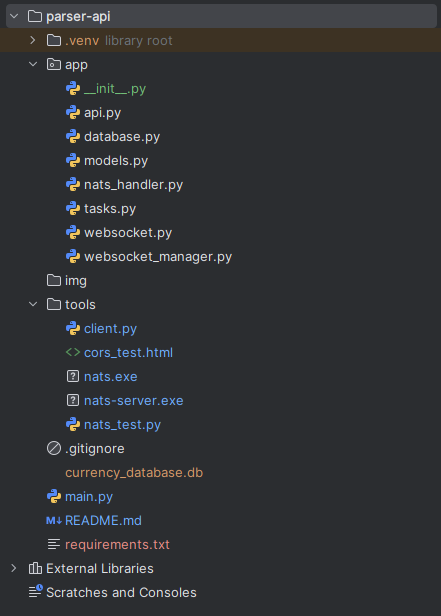
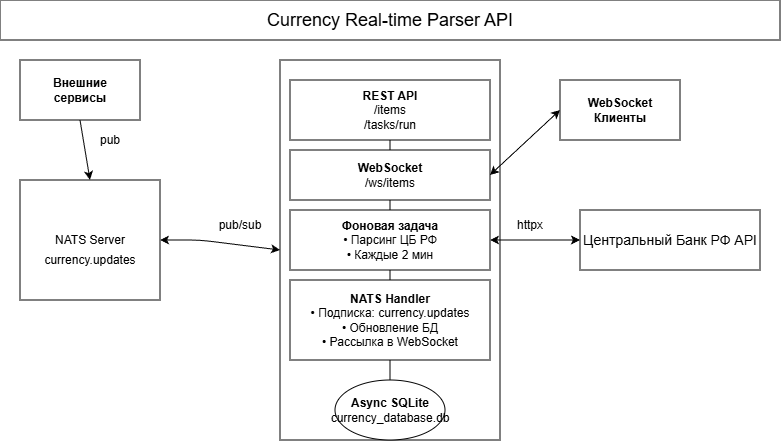
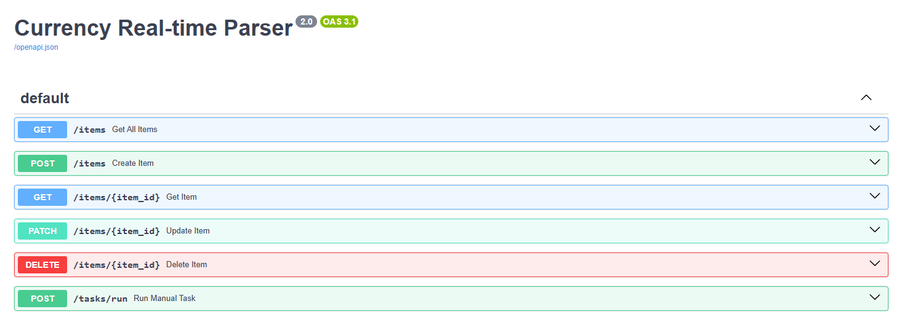
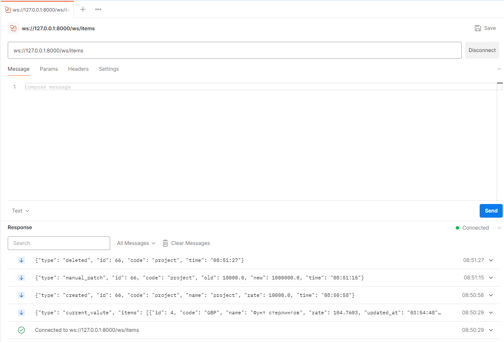
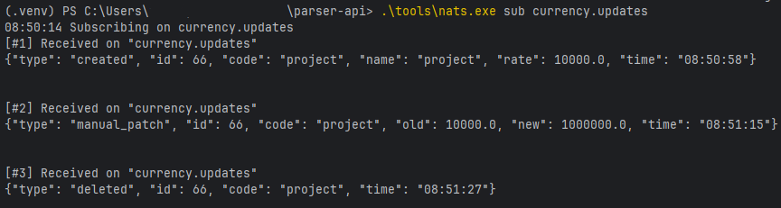
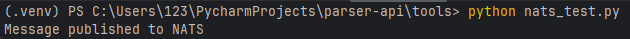
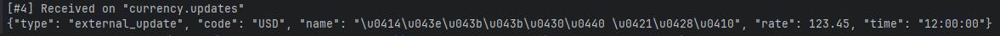
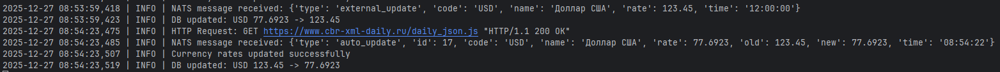

# 💱 Currency Parser API

> **Асинхронный backend на FastAPI** с REST API, WebSocket, фоновой задачей и интеграцией NATS  
> Парсит курсы валют с [официального API ЦБ РФ](https://www.cbr-xml-daily.ru/) и рассылает обновления в реальном времени.

## 📦 Технологии

- **FastAPI** - современный асинхронный фреймворк
- **SQLite** + **SQLModel** - лёгкая встроенная БД
- **WebSocket** - мгновенные уведомления клиентам
- **httpx** - асинхронные HTTP-запросы к API ЦБ РФ
- **NATS** - брокер сообщений для распределённых событий
- **Uvicorn** - сервер

---

## Структура проекта



```
parser-api/
├── README.md                 # Этот файл
├── main.py                   # Точка входа FastAPI-приложения
├── requirements.txt          # Зависимости Python
├── currency_database.db      # База данных (создаётся автоматически)
├── .gitignore                # Исключает временные файлы из Git
│
├── app/                      # Основной код приложения
│   ├── __init__.py           # Делает app/ Python-пакетом
│   ├── models.py             # Модель данных (CurrencyRate)
│   ├── database.py           # Настройка подключения к SQLite
│   ├── tasks.py              # Фоновая задача парсинга курсов
│   ├── nats_handler.py       # Подключение и обработка NATS-сообщений
│   ├── websocket_manager.py  # Управление WebSocket-подключениями
│   ├── websocket.py          # WebSocket-эндпоинт
│   └── api.py                # REST API маршруты
│
├── img/                      # Изображения для документации
│
└── tools/                    # Вспомогательные инструменты
    ├── nats-server.exe       # NATS-сервер (Windows)
    ├── nats.exe              # NATS CLI-клиент
    ├── client.py             # Пример WebSocket-клиента (для демо)
    └── nats_test.py          # Пример публикации в NATS (для теста)
```

---

## Архитектура проекта



---

## Как работает проект?

1. Фоновая задача (tasks.py) каждые 2 минуты:

* Запрашивает курсы у ЦБ РФ через httpx;
* Сравнивает с данными в SQLite;
* При изменении — обновляет БД и публикует событие в NATS.

2. NATS-подписчик (nats_handler.py):

* Получает все сообщения из темы currency.updates;
* Обновляет локальную БД (если нужно);
* Рассылает событие всем WebSocket-клиентам.

3. REST API (api.py):

* Любое действие (создание, PATCH, DELETE) также публикует в NATS;
* Таким образом, все изменения проходят через единую шину событий.

4. WebSocket:

* Клиенты получают единый формат уведомлений, независимо от источника (фон, REST, внешний сервис).

---

## 🚀 Запуск проекта

### 1. Установите зависимости

```
pip install -r requirements.txt
```

### 2. Запустите NATS-сервер

<b>⚠️ NATS должен быть запущен ДО старта FastAPI! ⚠️</b>

Из корня проекта в терминале нужно ввести команду:

```
.\tools\nats-server.exe
```

### 3. Запустите FastAPI-приложение

Чтобы запустить приложение, нужно открыть новый терминал (NATS уже должен работать) и ввести:

```
uvicorn main:app
```

---

## Swagger



| Метод | Путь               | Описание                           |
|:------|:-------------------|:-----------------------------------|
| GET   | `/items`           | Получить все валюты                |
| GET   | `/items/{id}`      | Получить валюту по ID              |
| POST  | `/items`           | Создать новую валюту вручную       |
| PATCH | `/items/{id}`      | Обновить курс валюты               |
| DELETE| `/items/{id}`      | Удалить валюту                     |
| POST  | `/tasks/run`       | Принудительно запустить парсинг    |


---

### 4. WebSocket

Подключение по WebSocket:

```
ws://127.0.0.1:8000/ws/items
```



### 5. NATS: публикация и подписка

Чтобы подписаться на события, нужно открыть новый терминал и ввести:

```
.\tools\nats.exe sub currency.updates
```



Ручная публикация производится таким способом:

```
.\tools\nats.exe pub currency.updates "{\"type\":\"external_update\",\"code\":\"BTC\",\"name\":\"Bitcoin\",\"rate\":5000000,\"time\":\"12:00:00\"}"
```

В проекте находится скрипт для имитации поведения другого микросервиса, который:

* не является частью приложения;
* может публиковать события в NATS по теме currency.update.

Для запуска требуется ввести в консоль:

```
python tools\nats_test.py
```

После запуска появится надпись, что сообщение опубликовано:



В консоли с NATS будет отображено данное сообщение:



И после автоматического обновления (каждые 2 минуты парсит сайт ЦБ РФ) происходит обновление валют:

